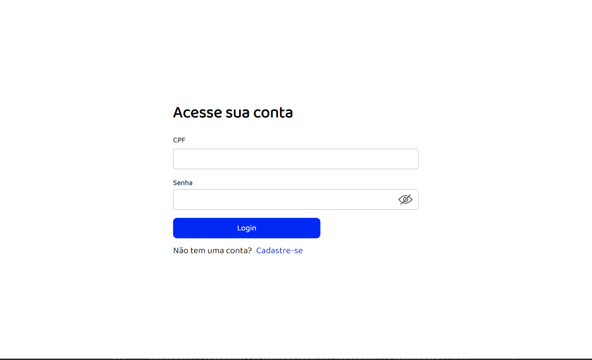

# **Dashboard bancário**

Dashboard feito para que o usuário possa organizar seu dinheiro, podendo fazer depósito e saque de dinheiro, com uma conexão à uma API feita em Laravel.

-- --

## **Screenshots**

-- --

## **Features**

- Criação de conta e geração automática de um número único para identificar a conta do usuário
- Login e Logout com a utilização do Context
- Depósito e Saque
- Histórico de depósitos e saques
- Filtrar histórico entre datas, exemplo: Ver o histórico entre os dias 12-01-2022 até 14-01-2022, todas as ações realizadas entre esse período serão retornadas e mostradas no histórico
- Histórico de saldo diário em um gráfico para ver a evolução entre os ultimos 6 dias.
- Deletar alguma linha do histórico de transações, (saldo não é alterado).
- A cada depósito ou saque realizado, o Saldo, Histórico e o Gráfico são atualizados automaticamentes para retornar as novas informações

-- --

## **Getting Started**

### Abra o Prompt de Comando

    git clone https://github.com/MatheusGomesRocha/dashboard
    cd dashboard && npm install

    git clone https://github.com/MatheusGomesRocha/dashboard_backend
    cd dashboard_backend && php artisan serve

### Para o frontend abra um novo Prompt de Comando

    cd path/dashboard && npm start
    
### Para o backend abra um novo Prompt de Comando

    Tenha PHP e Composer configurados na sua variável global PATH

    cd path/dashboard_backend

    composer install --no-scripts

    cp .env.example .env

    php artisan key:generate
    
    php artisan migrate --seed
    
    npm install

    php artisan serve
    

-- --

## **Tecnologia usada**

- React

-- --
## Meta

- Matheus Gomes
- Email - matheusgomes192@hotmail.com
- Linkedin - https://www.linkedin.com/in/matheus-gomes-2a61a8190/ 
